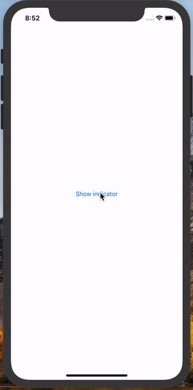

# ARActivityIndicator

[](https://travis-ci.org/ar.warraich@outlook.com/ARActivityIndicator)
[](https://cocoapods.org/pods/ARActivityIndicator)
[](https://cocoapods.org/pods/ARActivityIndicator)
[](https://cocoapods.org/pods/ARActivityIndicator)




## Requirements

- iOS 9.0
- Xcode 10.0+
- Swift 4.2+

## Installation

ARActivityIndicator is available through [CocoaPods](https://cocoapods.org). To install
it, simply add the following line to your Podfile:

```ruby
pod 'ARActivityIndicator'
```
Then, run the following command:

```ruby
pod install
```
## Usage 

### Import

```swift
import ARActivityIndicator
```
### Show ARActivityIndicator
 To show Activity Indicator call as following:

```swift
ARActivityIndicator.shared.showActivityIndicator()
```
Presentation animation can be added or removed and you can also add delay as following: 
```swift
ARActivityIndicator.shared.showActivityIndicator(withAnimation: true, withDelay: 3)
```
by default `withAnimation` is `true` and `delay` is `0`

### Hide ARActivityIndicator
To hide Activity Indicator call as following:

```swift
ARActivityIndicator.shared.hideActivityIndicator()
```
Dismiss animation can be added or removed and you can also add delay as following: 
```swift
ARActivityIndicator.shared.hideActivityIndicator(withAnimation: true, withDelay: 3)
```
by default `withAnimation` is `true` and `delay` is `0`

### Hide all ARActivityIndicator
If you want to remove all `ARActivityIndicator` call as following:

```swift
ARActivityIndicator.shared.removeAllActivityIndicator()
```
This will remove all `ARActivityIndicator` at once.

## Author

AbdulRehman  Warraich, ar.warraich@outlook.com

## License

ARAlertViewController is released under the MIT license. [See LICENSE](https://github.com/AbdulRehmanWarraich/ARActivityIndicator/blob/master/LICENSE) for details.

